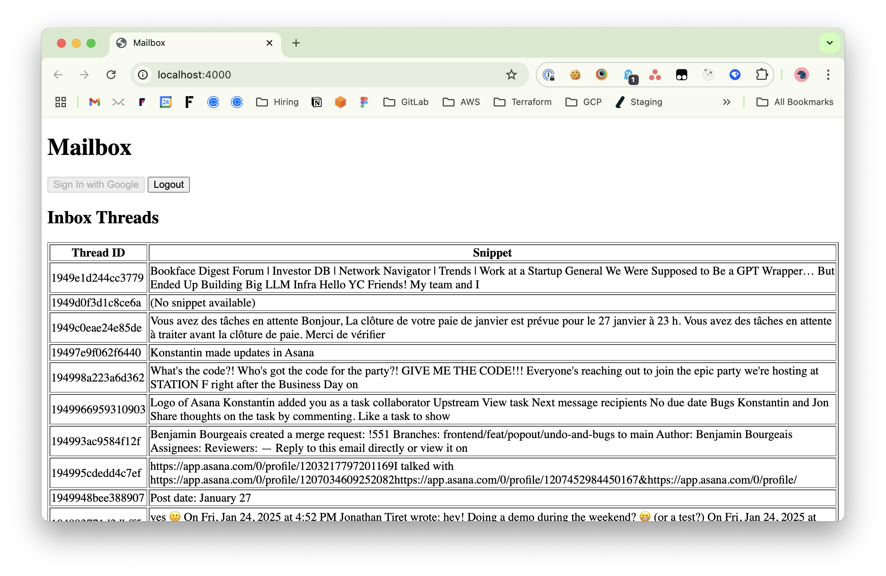

# Mailbox Manager

## Context

This project was created as part of an observation internship at **Upstream**. It is a **frontend-only application** designed to manage a Gmail inbox by integrating the **Gmail API**.

The goal of this project is to introduce web development concepts such as **HTML**, **CSS**, and **TypeScript/JavaScript**, while exploring the integration of an external API, specifically the **Gmail API**.

## Features



- Google Sign-In to authenticate users.
- Displays the 50 most recent threads from a Gmail account.
- Dynamically updates the thread list every 10 seconds.
- Basic UI with a table displaying the thread IDs and snippets.

## Resources

To learn more about the Gmail API and how to use it, refer to the official documentation:  
[**Gmail API Reference**](https://developers.google.com/gmail/api/reference/rest)

---

## How to Run

1. Clone this repository:

   ```bash
   git clone https://github.com/upstream-engineering/mailbox-manager.git
   cd mailbox-manager
   ```

2. Install dependencies:

   ```bash
   yarn
   ```

3. Run the application:

   ```bash
   yarn dev
   ```

4. Open your browser and navigate to http://localhost:4000.

## To-Do List

### Objectives for Improvement

1. **Filter Inbox Threads**

   - Modify the application to only display threads from the **Inbox**.  
     Currently, it shows all recent threads, including those not in the Inbox.

2. **Enhance UI Design**

   - Improve the interface by:
     - Using a more attractive font.
     - Adding colors for better readability.
     - Styling the table to make it more visually appealing.

3. **Unread Thread Indicator**

   - Display a blue badge in the table for threads that contain **unread messages**.

4. **Thread Subject**

   - Add the **subject** of each thread to the table.

5. **List Email Recipients**

   - Show the list of recipients for each email in the thread.

6. **Display Thread Messages**

   - When a thread is clicked, display the list of all **messages** within the thread.

7. **Mark Threads as Read**
   - Add functionality to mark a thread as **read**:
     - Automatically mark it as read when the thread is opened.
     - Alternatively, provide a button to manually mark it as read.
